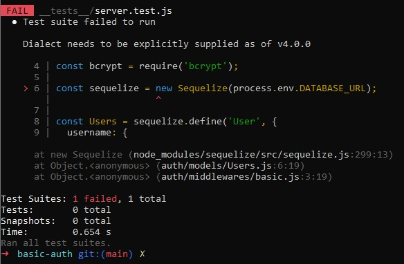

# [Heroku Link](https://dft-api-server.herokuapp.com)


# UML


# Install and Test Instructions

Step 1: Git clone [Repo Link](https://dftjr-basic-auth.herokuapp.com)

Step 2: Install the nodes <code>npm i</code>

Step 3: Run the tests <code>npm test</code>

Step 4: Check to see that the code is passing, should look the the following picture below:

New error popping up for Sequelize, couldn't figure out the solution online. Posting the test for now as is.



Step 5: Set-up your .env PORT path to whatever you prefer

Step 6: Start the server <code>nodemon</code>


# Notes Class 06: Authentication and Basic Auth

## Warm Up

Print linked list values in reverse

```javascript

// Big 0: time - 0(n) space - 0(n)
function printReverse(ll) {
  // push everything into an array first
  // traverse
  let current = ll. head;
  let array = [];
  let i = 0;
  while (current != null) {
    array[i] = current.data;
    current = current.next;
    i ++;
  }

  for(let i = array.length; i > 0; i--){
    console.log(array[i - 1]);
  }
}

```

## Review

* RESTful web services with Express:
  * Routing - express uses a method and path.
    * Method: GET / POSTS / PUT || PATCHES / DELETE
    * each method relates to a CRUD operation
      GET - READ
      POST - CREATE
      PUT | PATCH - UPDATE
      DELETE - DELETE
  * Middleware - a function that "sits" or gets invoked on a route.
    * Gets access to the request and the response (runs in between the request hitting the router and the response being sent back to the client)
  * Error handling - Promise.reject() => .catch(e)
    * app.use(errorHandler)
    * call the `next({message: 'invalid route'})` function passing the error as an argument.

## Encoding and Encryption

Base-64: encoding standard, uses binary, ensures that machines from each end of an HTTP request, can read the appropriate.
Bcrypt

## Authenticating Web Services

Every request should be able to answer the question:  Who is making this request?  Initially we want to give users the ability to signup / register as a User.  Once that is done, we need to build software that can validate a user using Authentication Headers:

Whiteboard Diagram: https://projects.invisionapp.com/freehand/document/uJQbHxB5f

## DEMO: Basic Authentication Middleware

* Encode Basic Authentication credentials onto an HTTP request.
* Decode Basic Authentication credentials server side.
* Find a specified user, validate their password.
* If a user is valid,  allow our request to proceed, or send back an error code.